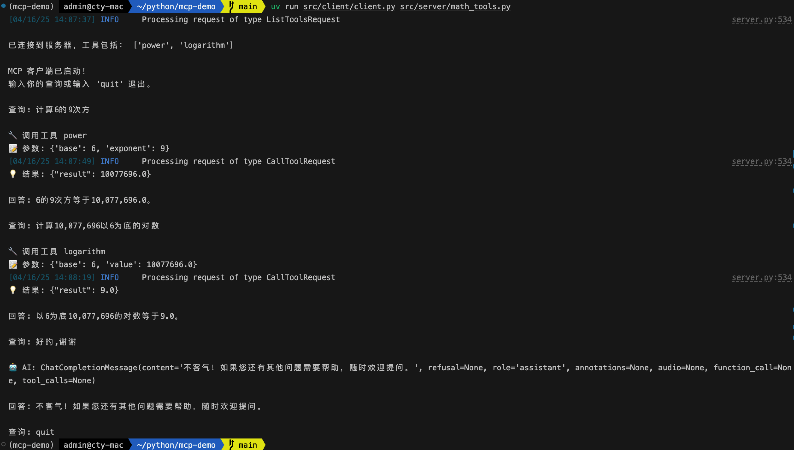

# MCP-Demo
* https://mcp-docs.cn/introduction
* https://github.com/modelcontextprotocol/python-sdk

## 准备环境
* 安装 uv
```shell
curl -LsSf https://astral.sh/uv/install.sh | sh
```

* 准备 Python 环境和依赖
```shell
cd mcp-demo
# 创建 virtual environment 并激活
uv venv
source .venv/bin/activate
# 安装项目依赖
uv sync
```
* 配置 OpenAI SDK 环境变量
```shell
cat <<EOF > .env
OPENAI_BASE_URL=xxx
OPENAI_API_KEY=sk-xxx
OPENAI_MODEL=qwen-max
EOF
```

## tool-stdio
* **server**: server/math_tools.py
* **client**: client/client.py
* 运行客户端：
```shell
cd mcp-demo
uv run src/client/client.py src/server/math_tools.py
```
* 测试结果：

