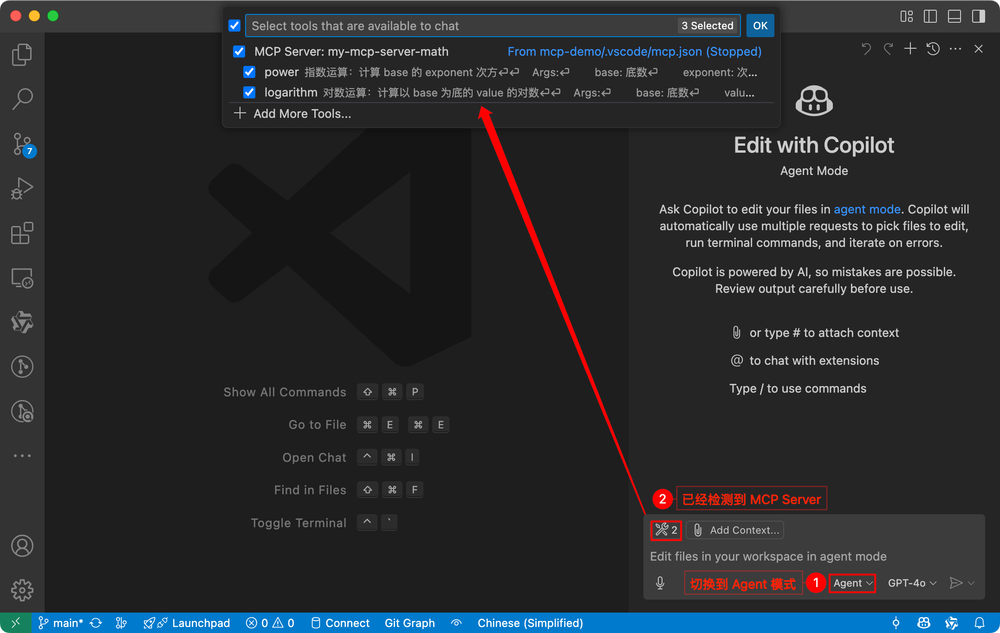
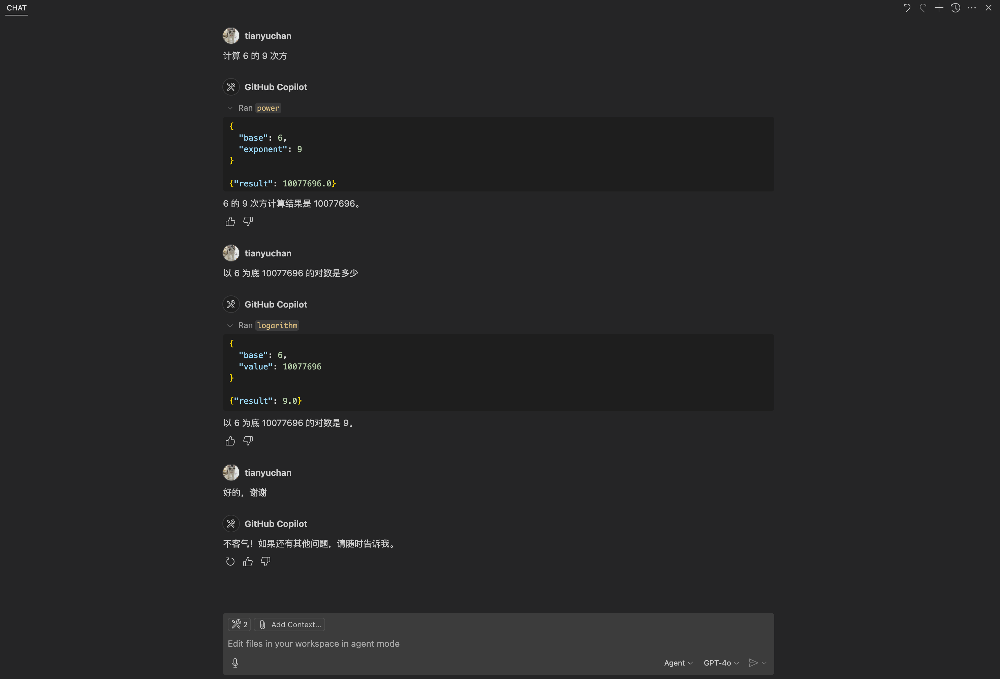
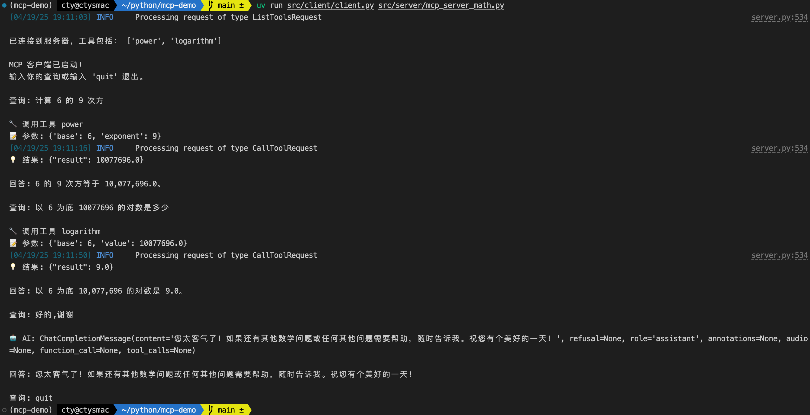
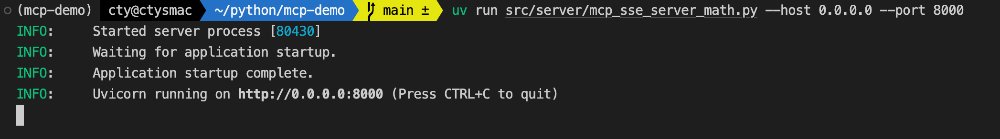
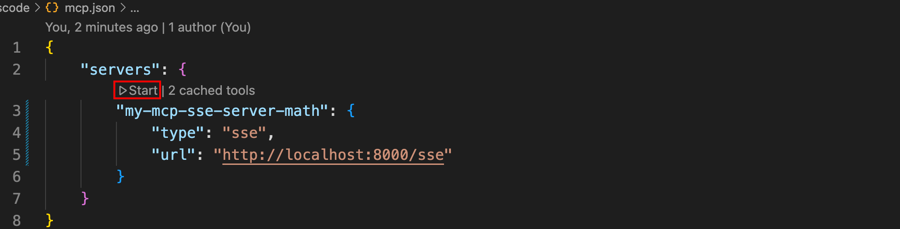
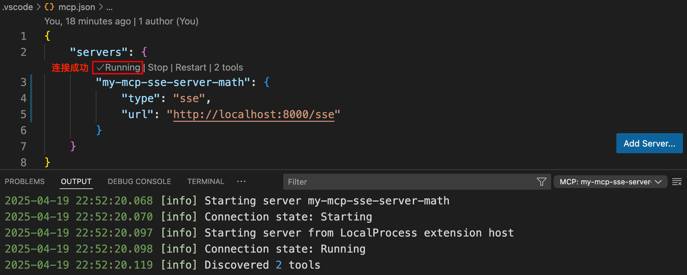
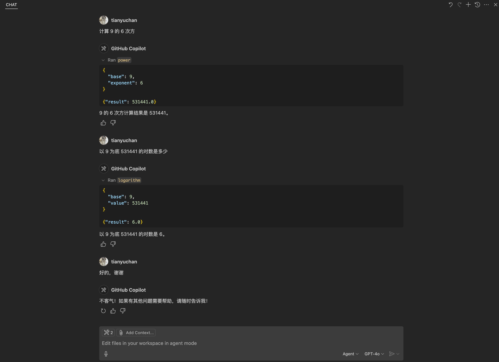
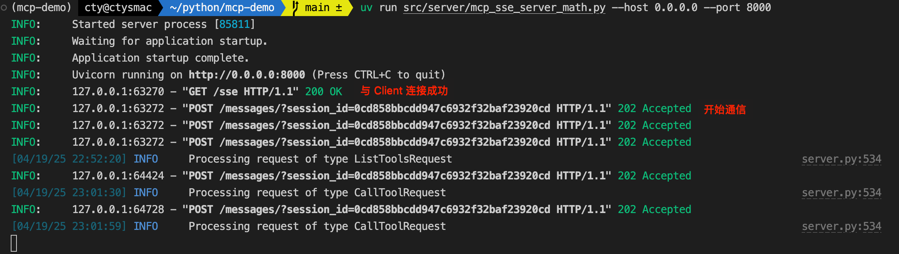
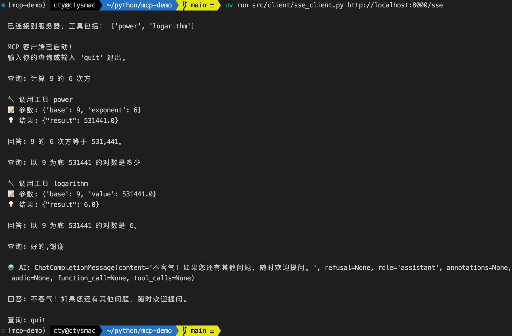

# MCP-Demo

[TOC]

## 基本概念

### MCP
Model Context Protocol (MCP) 是一个开放协议，它为应用程序向 LLM 提供上下文的方式进行了标准化。你可以将 MCP 想象成 AI 应用程序的 USB-C 接口。就像 USB-C 为设备连接各种外设和配件提供了标准化的方式一样，MCP 为 AI 模型连接各种数据源和工具提供了标准化的接口。

* 了解 MCP 的[核心架构](https://mcp-docs.cn/docs/concepts/architecture)（必看）
* 深入 MCP 的[详细规范](https://mcp-docs.cn/specification/2025-03-26)（选读）

### 核心功能
MCP 协议定义 MCP 服务器可以实现的三个核心功能：

| Primitive | Control            | Description                                | Example Use            |
|-----------|--------------------|--------------------------------------------|------------------------|
| Prompts   | User-controlled    | Interactive templates invoked by user choice | Slash commands, menu options |
| Resources | Application-controlled | Contextual data managed by the client application | File contents, API responses |
| Tools     | Model-controlled   | Functions exposed to the LLM to take actions | API calls, data updates |

### 传输层
MCP 中的传输层为 clients 和 servers 之间的通信提供基础。传输层处理消息发送和接收的底层机制。

MCP 包含两个标准传输实现（也可以自定义传输层）：
| 传输层 | 说明 |
|------------|--------|
| 标准输入输出 (stdio) | Server 和 Client 在同一主机上，通过标准输入和输出流进行通信，对于本地集成和命令行工具特别有用。 |
| 服务器发送事件 (SSE) | Server 和 Client 在不同主机上，通过 HTTP POST 请求实现服务器到客户端的流式通信。 |

### Python SDK

MCP 官方提供了一些主流编程语言（[Python](https://github.com/modelcontextprotocol/python-sdk)、[TypeScript](https://github.com/modelcontextprotocol/typescript-sdk) 等）的 SDK， 这些 SDK 实现了完整的 [MCP 规范](https://modelcontextprotocol.io/specification/2025-03-26)。

MCP Python SDK 中提供以下两种 MCP Server 实现方式：
| 实现方式   | 易用性 | 个性化 |
|------------|--------|--------|
| FastMCP Server    | 高     | 低     |
| Low-Level Server | 低     | 高     |


## 准备环境
* 安装 uv
```shell
curl -LsSf https://astral.sh/uv/install.sh | sh
```

* 准备 Python 环境和依赖
```shell
cd mcp-demo
# 创建虚拟环境并安装项目依赖
uv sync
```
* 配置 OpenAI SDK 环境变量
```shell
cat <<EOF > .env
OPENAI_BASE_URL=https://dashscope.aliyuncs.com/compatible-mode/v1
OPENAI_API_KEY=sk-xxx  # 替换为自己的 API Key
OPENAI_MODEL=qwen-max
EOF
```

## Tools-stdio

### Server

使用 FastMCP server 封装一个提供数学运算工具的 MCP Server，并采用 stdio 作为传输层：
[src/server/mcp_server_math.py](src/server/mcp_server_math.py)

### Client: GitHub Copilot
使用 GitHub Copilot 测试 MCP Server（其他支持 MCP 集成的应用见：[Clients 示例](https://mcp-docs.cn/clients)），具体步骤如下：

1. mcp-demo/.vscode/mcp.json 中添加以下内容：
```json
{
    "servers": {
        "my-mcp-server-math": {
            "type": "stdio",
            "command": "uv",
            "args": [
                "--directory",
                "/Users/cty/python/mcp-demo/src/server/",  # 替换为自己的路径
                "run",
                "mcp_server_math.py"
            ]
        }
    }
}
```
2. Copilot 选择 Agent 模式，可以发现已经检测到 MCP Server。



3. 测试结果：




### Client: Python Code
使用 MCP Python SDK 编写代码实现使用 stdio 传输层的 MCP Client：[src/client/client.py](src/client/client.py)，然后测试 MCP Server，具体步骤如下：

1. 运行客户端：
```shell
cd mcp-demo
uv run src/client/client.py src/server/mcp_server_math.py
```

2. 测试结果：




## Tools-SSE

### Server
以下使用 FastMCP server 封装一个提供数学运算工具的 MCP Server，并采用 SSE 作为传输层：
[src/server/mcp_sse_server_math.py](src/server/mcp_sse_server_math.py)

1. 启动 MCP服务器（可将其部署在云服务器中）：
```shell
uv run src/server/mcp_sse_server_math.py --host 0.0.0.0 --port 8000
```



### Client: GitHub Copilot
使用 GitHub Copilot 测试 MCP Server，具体步骤如下：

1. mcp-demo/.vscode/mcp.json 中添加以下内容：
```json
{
    "servers": {
        "my-mcp-sse-server-math": {
            "type": "sse",
            "url": "http://localhost:8000/sse"  # 替换为自己的 URL
        }
    }
}
```
2. 手动连接 MCP Server




3. Copilot 选择 Agent 模式，可以发现已经检测到 MCP Server。

4. 测试结果：



5. MCP Server 日志：



### Client: Python Code
使用 MCP Python SDK 编写代码实现使用 SSE 传输层的 MCP Client：[src/client/sse_client.py](src/client/sse_client.py)，然后测试 MCP Server，具体步骤如下：

1. 运行客户端：
```shell
cd mcp-demo
uv run src/client/sse_client.py http://localhost:8000/sse
```

2. 测试结果：




## 参考资料
* https://mcp-docs.cn/introduction
* https://github.com/modelcontextprotocol/python-sdk
* https://blog.csdn.net/GOBinCC/article/details/146290820
